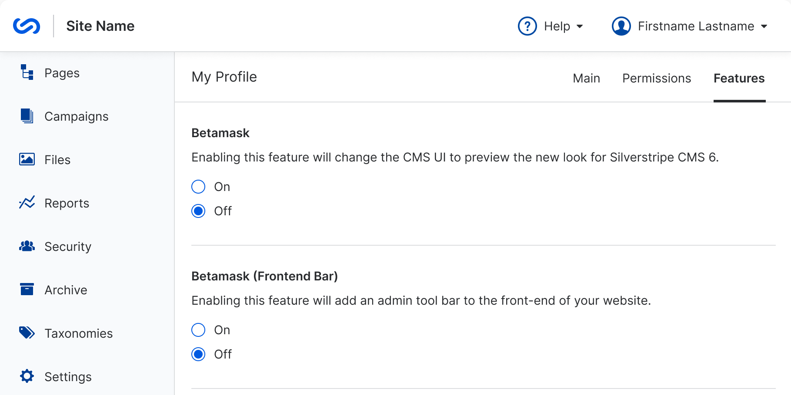

# Betamask CMS theme

Adds a feature-flagged new look for Silverstripe CMS.



## Requirements

* php >= 8.1
* SilverStripe ^5

## Installation

```sh
composer require silverstripeltd/betamask
```

## How to use

After installing the module:

1. Go to `/admin/myprofile`
1. Navigate to the "Features" tab
1. Tick "On" under "Betamask" and save

This will turn on the new look for you - each user who wants to use the new look must enable it independently.
